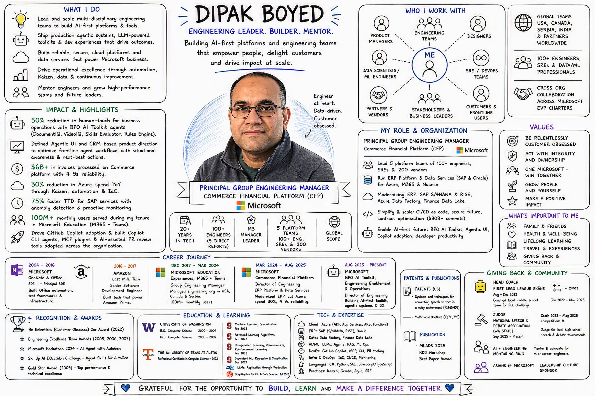

# Resume — Dipak Boyed

📄 **Live resume:** [dipakboyed.github.io/resume](https://dipakboyed.github.io/resume/)

📥 **PDF resume:** [Dipak-Boyed-Resume.pdf](https://dipakboyed.github.io/resume/assets/Dipak-Boyed-Resume.pdf)

🎨 **Visual resume:** a whiteboard snapshot of my work life sits at the top of the live page (click it to open full size).

<p align="center">
  <a href="assets/img/worklife-whiteboard-hd.png">
    
  </a>
</p>

## Generate a PDF from any branch

The PDF always builds on a GitHub-hosted Ubuntu runner. It does not depend on local software.

1. Open the repository **Actions** page.
2. Select **Build Resume PDF**.
3. Select **Run workflow**.
4. Select the source branch.
5. Download the named resume artifact from the completed run.

Use GitHub CLI as an alternative:

```powershell
gh workflow run resume.yml --ref <branch-name>
gh run watch
```

A branch build uploads an artifact only. A push to `main` deploys the validated site and PDF to GitHub Pages.

Before the first deployment, set **Settings → Pages → Build and deployment → Source** to **GitHub Actions**. The previous legacy branch source does not publish the generated PDF.
